# Пакет PSST

## Содержание

1. [Введение](#Введение)
2. [О программе](#О-программе)
3. [Считывание расчетной сетки](#Считывание-расчетной-сетки)
    1. [Принцип работы psstGridReader](#Принцип-работы-psstGridReader)
    2. [Класс psstAnsysGridReader](#Класс-psstAnsysGridReader)
    3. [Формат сетки](#Формат-сетки)
    4. [Формат сетки с висячими узлами](#Формат-сетки-с-висячими-узлами)
4. [Класс psstGridFV](#Класс-psstGridFV)
    1. [Создание конечно-объемной сетки](#Создание-конечно-объемной-сетки)
    2. [Хранение переменных поля](#Хранение-переменных-поля)
    3. [Считывание параметров солвера](#Считывание-параметров-солвера)
    4. [Структура явного солвера](#Структура-явного-солвера)
5. [Учет граничных условий](#Учет-граничных-условий)
6. [Расчет градиентов](#Расчет-градиентов)
7. [Реконструктор и ограничители](#Реконструктор-и-ограничители)
8. [Вычисление шага по псевдовремени](#Вычисление-шага-по-псевдовремени)
9. [Вычисление конвективных потоков](#Вычисление-конвективных-потоков)
10. [Запуск расчета в пакете PSST](#Запуск-расчета-в-пакете-PSST)
    1. [Двумерный расчет](#Двумерный-расчет)
    2. [Трехмерный расчет](#Трехмерный-расчет)
11. [Список литературы](#Cписок-литературы)

## Введение

При исследовании сверхзвуковых течений газов размеры пограничных слоев, как правило, существенно меньше масштаба задачи, поэтому достаточно часто для описания используются модель невязкой жидкости, поведение которой описывается системой уравнений Эйлера, отражающей законы сохранения массы, импульса и энергии, которая замыкается при помощи модели идеального газа.

Поскольку сверхзвуковые течения могут содержать газодинамические разрывы (ударные волны, контактные разрывы) - узкие области с резким изменением параметров, при численном моделировании таких течений методами сквозного счета особенно важным является построение качественной расчетной сетки. Для более точного моделирования широко применяются адаптивные расчетные сетки: сетки, дающие возможность перераспределять исходные узлы в зависимости от особенностей получающегося решения, что позволяет при расчете максимально эффективно разрешать особенности течения.

Задачи с разрывными решениями характеризуются тем, что достаточно большие зоны имеют малые или умеренные значения градиентов параметров решения, когда как вместе с тем встречаются сравнительно узкие области, градиенты параметров решения в которых достигают больших величин. Соответственно, вычисленные градиенты могут послужить критерием, согласно которому происходит идентификация зоны для адаптации и критерием ее изменения.

В настоящее время наиболее распространнеными являются методы локальной адаптации, основанные на перемещении узлов, и методы дробления-слияния. В методах, основанных на перемещении узлов полагается, что общее число узлов расчетной области не изменяется. Адаптация просходит за счет сгущения уже существующих узлов к областям повышенных градиентов. Методы дробления-слияния основаны на измельчении/огрублении сетки в областях адаптации, которые определяются на основании заданных критериев. Данный подход широко распространен, поскольку является более универсальным. В частности, методы дробления/слияния реализованы в коммерческом пакете ANSYS Fluent.

Использование методов адаптации, основанных на дроблении/слиянии, приводит к образованию так называемых висячих узлов. Висячие узлы - это вспомогательные узлы, возникающие в процессе разбиения исходной ячейки на более мелкие или при объединении яеек в одную крупную. Таким образом, даные узлы, формально, не участвуют в образовании более крупного соседнего объема, но являются составляющим элементом новообразованных ячеек.

")

При использовании методов дробления/слияния полагается, что на ребре не может быть более одного висячего узла, т.к. в противном случае структура сетки сильно усложняется, а, кроме того, размеры двух соседних ячеек могут сильно отличаться, что приводит к большим вычислительным ошибкам. Грань, на которой имеется висячий узел, при расчете рассматривается как два ребра. Таким образом, применение методов адаптации приводит к тому, что получается достаточно сложная структура сетки, и исследование особенностей применения численных схем при использловании подобных сеток является важной и актуальной задачей.

Плюсом такого подхода является то, что при аккуратной структуризации процесс адаптации обратим. Таким образом, можно получать решения, не искажая входных данных расчетной сетки потребителя, в отличие от методов, основанных на перемещении узлов.

Целью работы является программная реализация численных методов для расчета сверхзвуковых течений на неструктурированных сетках, включая возможность расчета на адаптированных сетках с висячими узлами.

## О программе

Программа PSST( **P**ocket **S**uper**s**onic **T**ools) написана на языке C++, являющийся компилируемым статически типизированным языком программирования общего назначения. В пакете PSST реализован численный метод для расчета сверхзвуковых течений невязкого газа на неструктурированных сетках. Упрощенно алгоритм работы программы выглядит следующим образом:

- Считывание расчетной сетки. Создание навигации по областям вычислительной сетки (*psstGridReader*)
- Расчет параметров сетки (размеры ячеек, нормалей и т.п.) (*psstFVGrid*);
- Задание начального приближения. Задание свойств среды (удельная теплоемкость при постоянном давлении, молярная масса);
- Создание граничных условий (*psstBoundaryCondition*). Привязка граничных условий;
- Задание числа Куранта. Определение способа расчета шага по псевдовремени (*psstLocalTimeCalculation*)
- Задание максимального числа итераций и шага промежуточного сохранения;
- Настройка многошагового метода Рунге-Кутты (*psstRungeKutta*);
- Задание порядка схемы (*psstValueReconstruction*) и способа расчета конвективных потоков (*psstConvectiveFlow*);
- Задание способа расчета градиента в центрах ячеек (*psstGradCalculation*);
- Выбор ограничителя (*psstScalarLimiters*);
- Решение системы уравнений Эйлера (*psstFVGrid*);
- Вывод полученных результатов (*psstOutputManager*).

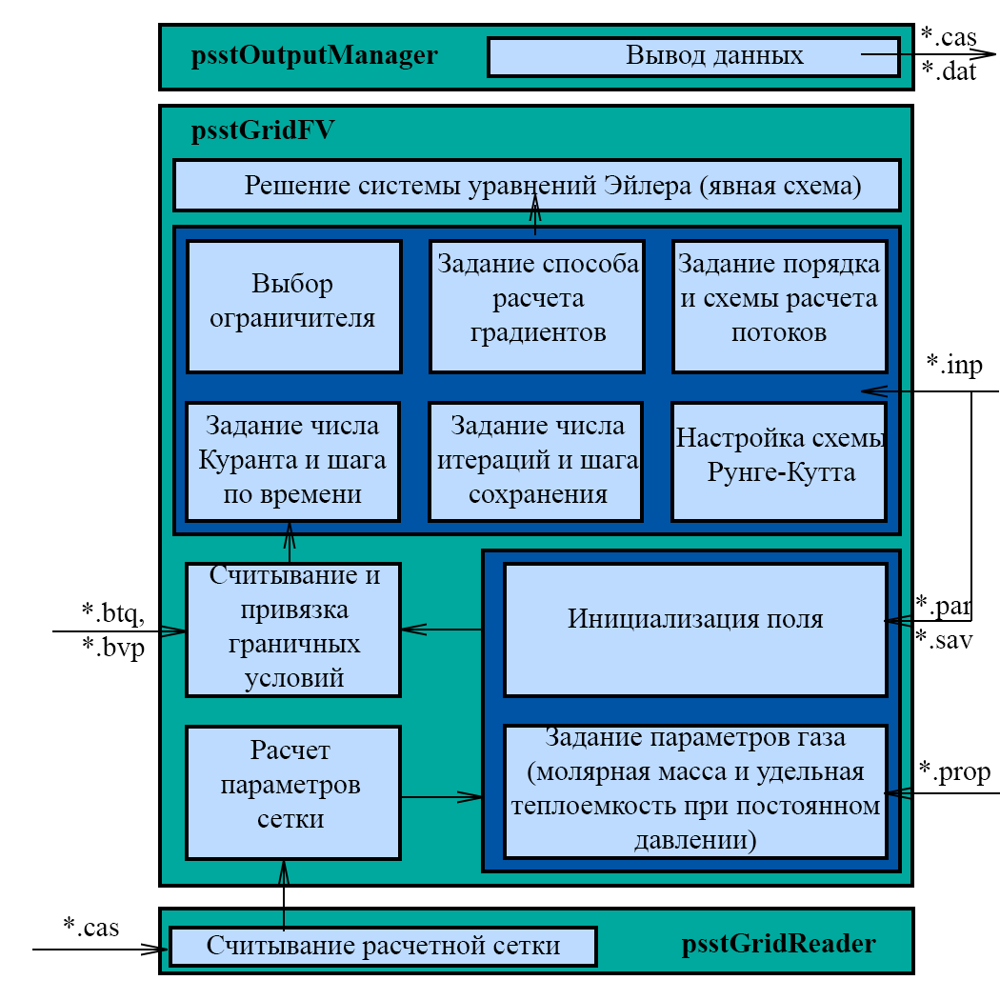

## Считывание расчетной сетки

### Принцип работы psstGridReader

За считывание расчетной сетки отвечает *psstGridReader.h*. Здесь содержатся классы *psstInterfaceSimpleVertex*, *psstInterfaceSimpleFace*, *psstInterfaceSimpleCell*, *psstInterfaceSimpleStorage*, *psstSimpleConnection*, явлющиеся классами упрощенных вершины грани, ячейки, навигатора и "родственных" связей соответственно. Также содержится класс входной сетки *psstInterfaceInputGrid*. Для создания сетки используется порождающий паттерн строитель (*psstInterfaceGridBuilder*) с надстроенным классом директор (*psstInterfaceGridDirector*).

*Строитель* - это порождающий паттерн проектирования, который позволяет создавать сложные объекты пошагово. Строитель дает возможность использовать один и тот же код строительства для получения разных представлений объектов.

*Директор* - вспомогательный класс, задающий порядок строительства, который выполняет строитель.

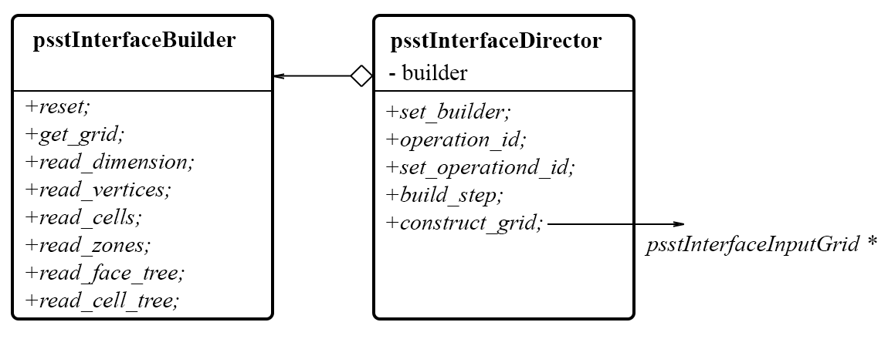

### Класс psstAnsysGridReader

Все вышеперечисленные классы являются чисто виртуальными. Конкретные реализации методов содержатся в наследниках данных классов, определенных в файлах *psstAnsysGridReader.h* и *psstAnsysGridReader.cpp*. Данная реализация предназначена для считывания и хранения сеток, создаваемых пакетом *ANSYS Fluent*, формат которых будет рассмотрен далее.

Класс *psstAnsysInputGrid*, являющийся наследником класса *psstInterfaceInputGrid*, по своей сути является буфером для считываемой сетки. Здесь содержаться "облегченные" структуры элементов сетки, строится первичная навигация.

Согласно МКО (метод конечных объемов) пространственная дискретизация задачи осуществляется путем разбиения расчетной области на небольшие соприкасающиеся ячейки. Каждая такая ячейка ограничена гранями, которые в свою очередь, опираются на узлы расчетной сетки.

Класс *psstSimpleVertex*, являющийся наследником класса *psstInterfaceSimpleVertex*, есть упрощенный класс для хранения координаты вершины. Здесь хранятся координаты вершины, размерность задачи (двумерная, трехмерная). От своего "полного" аналога *psstVertex*, используемом в классе *psstGridFV*, отличается тем, что не хранит свой идентификатор (порядковый номер в массиве), так как эта информация необходима только для организации выходных данных в классе *psstOutputManager* и является излишней при считывании.

Наследник класса *psstInterfaceSimpleFace* *psstSimpleFace* служит для хранения грани. Данный класс предполагает хранение вершин, на которых строится грань, тип вершины, идентификатор зоны, а также левый и правый объемы (их идентификаторы). На этапе считывания информация о положении центра грани, координатах нормали, площади грани не является необходимой, а поэтому на данной шаге не рассчитывается. Первым при считывании подается положение в массиве правого объема, а затем - левого. Для определения какой объем является правым, а какой левым используется правило буравчика: по обходу вершин (по часовой или против) определяется направление нормали. Правым объемом будем называть тот, в чью сторону направлен вектор нормали. В двумерном случае для определения какой объем является правым, а какой левым используется следующая логика: вводится вектор **k**, направленный от поверхности сетки(экрана) на наблюдателя(пользователя) и вектор **r** направленный от первой считанной вершины до второй. Правым объемом будет являться тот, в чью сторону направлено векторное произведение векторов **k** и **r**. 

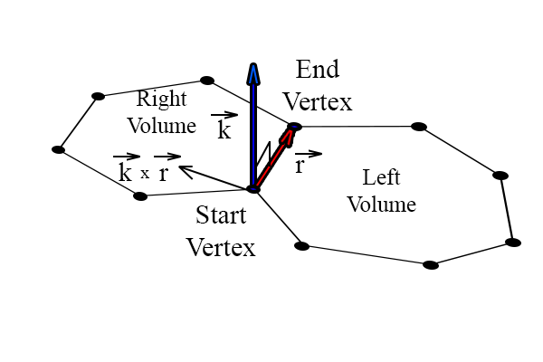

Класс *psstSimpleCell*, наследуемый от *psstInterfaceSimpleCell* хранит лишь информацию о типе ячейки и индексе зоны: в отличие от "полного" аналога *psstVolume*, используемом в *psstGridFV* здесь не хранится центр ячейки, ее объем, переменные поля и т.п.

Наследник класса *psstInterfaceSimpleStorage* *psstSimpleStorage* хранит сеточные зоны. Здесь хранится идентификатор, первый и последний индексы в массиве элементов соотсветствующей зоны, индекс граничного условия, содержащегося в самой сетке, число элементов зоны, имя зоны, а также индексы родительской зоны и индексы дочерных. Сама же "родственная" связь храничится в классе *psstSimpleConnection*, содержащим индекс родительского элемента, число детей и массив индексов дочерних элементов.

Для навигации по областям расчетной области используются стандартные контейнеры *std::vector* и *std::map*. *std::vector* представляет собой последовательный контейнер, инкапсулирующий массивы переменного размера. *std::map* - отсортированный ассоциативный контейнер, который содержит пары ключ-значение с неповторяющимися ключами. Порядок ключей задается функцией сравнения *Compare*. Операции поиска, удаления и вставки для данного контейнера имеют логарифмическую сложность. Под навигацией на данном этапе подразумевается вектор объектов *psstSimpleStorage* в связке с *std::map*, ключ которой - идентификатор зоны, а значение - индекс зоны в векторе.

### Формат сетки

Сетка, генерируемая пакетом *ANSYS* представляет из себя набор секций с сопутствующими им данными (для записи данных, за исключением координат узлов, используются числа в шестнадцатиричной форме). Каждая секция одного типа имеет свой уникальный индекс, что и позволяет реализовать создание сетки путем отношения строитель-директор: *psstAnsysDirector* считывает индекс секции из файла и отправляет *psstAnsysBuilder* сигнал об обработке данных секции. Опишем, какие секции программа *PSST* умеет обрабатывать.

#### Секция считывания размерности

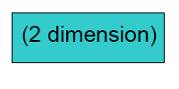

Индекс секции размерности 2. Здесь подается размерность задачи *dimension* (двумерная или трехмерная). Данная секция не является обязательной: при наличии используется для проверки поданных в секции считывания узлов координат.

#### Секция считывания узлов

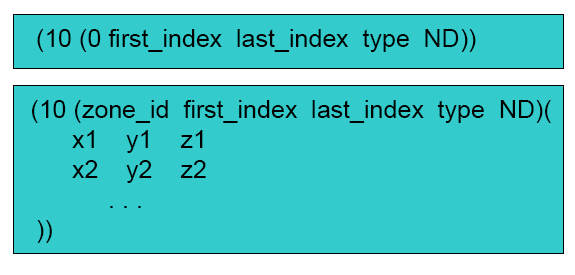

Индекс секции считывания узлов 10. Здесь подается следующая информация: *zone-id* - идентификатор зоны, которой принадлежит узел; *first-index* и *last-index* - первый и последний индексы узлов зоны *zone-id* в общем массиве узлов; *type* - тип узлов; *ND* - размерность узлов.

Стоит отметить, что информация об идентификаторе узловой зоны, а также о типе узла, не использовались: все узлы находятся в едином массиве, разделение на типы не учитывается. При значении ND = 2 значения z-координаты не подаются: в каждой отдельно строке приводится только x и y координаты. Если индекс зоны равен нулю, то последующий ввод координат не трубется: здесь дается информация об общем числе узлов в сетке.

#### Секция считывания ячеек

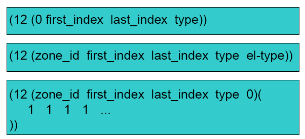

Индекс секции считывания ячеек 12. Здесь подается следующая информация: *zone-id* - идентификатор зоны, которой принадлежит ячейка; *first-index* и *last-index* - первый и последний индексы ячеек зоны *zone-id* в общем массиве ячеек; *type* - тип ячейки; *el-type* - тип формы ячейки.

В случае равенства нулю индекса зоны подается информация о числе ячеек в целом, при этом значения *type* не учитывается, *el-type* отсутствует. В виду того, что рассматривается задача гидрогазодинамики, то считается, что величина *type* может принимать либо значение 1, что в *ANSYS* идентифицируется как флюид, либо значение 32 - индекс родительской ячейки. При рассмотрении, к примеру, двумерной задачи сетка такого формата может содержать ячейки, у которых *el-type* = 1 (треугольная) и *el-type* = 2 (четырехугольная ячейка). Если же *el-type* = 0, то это значит, что данная зона содержит ячейки разного типа формы. В такой ситуации необходимо перечислить типы формы ячеек данной зоны.

#### Секция считывания граней

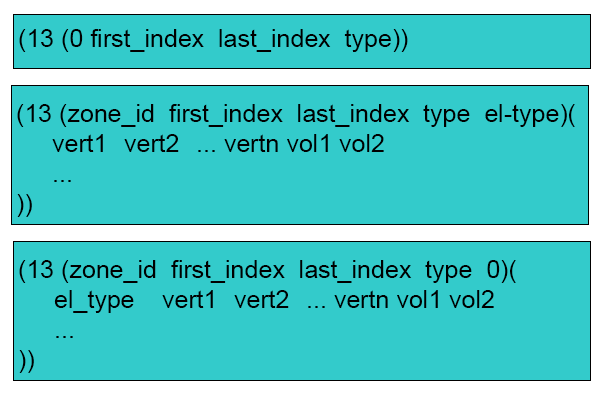

Индекс секции считывания граней 13. Здесь подается следующая информация: *zone-id* идентификатор зоны, которой принадлежит грань; *first-index* и *last-index* - первый и последний индексы граней зоны *zone-id* в общем массиве граней; *type* - тип грани; *el-type* - тип формы грани. Если *zone-id* = 0, то дается информация об общем числе граней, *el-type* при этом не вводится. В противном случае далее в каждой строчке идет перечисление: индексов вершин в общем массиве узлов, принадлежащих грани; индекс левой и правой ячейки в общем массиве ячеек. Если *el-type* равен нулю, то в каждой строке указывается тип считываемой грани. В случае, когда грань граничная, она соприкасается лишь с одним объемом: индекс второго несуществующего объема равен 0.

#### Секция считывания зоны

Секция считывания зоны может иметь индекс либо 39, либо 45. В обоих случаях секция считывания узлов выглядит следующим образом:

*(39/45 (zone-id type-name zone-name)())*

Здесь *zone-id* - индекс зоны; *type-name* - имя типа зоны; *zone-name* - имя зоны. Стоит отметить, что информация об имени типа зоны в программе игнорируется.

### Формат сетки с висячими узлами

При реализации методов адаптации на основе дробления/слияния ячеек возникает необходимость работы с вычислительными сетками, содержащими висячие узлы. Формат сеток с висячими узлами предполагает хранение дерева граней и дерева объемов, которым отвечают секции 59 и 59 соотвественно.

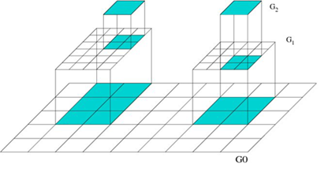

Дерево отвечаетс за хранение "родственных" связей элементов: здесь для каждой грани/ячейки содержится информация о том, какая грань/ячейка была "порождена" от текущей. Таким образом, имеется возможность вернуться на более ранние уровни разбиения, в том числе, и до исходного состояния сетки до адаптации.

 и 59(дерево граней)")

Здесь *cell-id0/face-id0* - индекс первой ячейки/грани в секции *parent-zone-id*; *cell-id1/face-id1* - индекс последней ячейки/грани в секции *parent-zone-id*; *parent-zone-id* - идентификатор зоны порожденных (активных) элементов; *number-of-kids* - число порожденных элементов; *kid-id-i* - i-ый индекс порожденного элемента.

При измельчении ячейки/грани (родителя), новые ячейки/грани (дети) добавляются в секцию 12/13 в зоны измельчаемых ячеек/граней. При этом измельчаемая ячейка/грань переносится в фиктивную зону родителей, не участвующих в расчетах, тип ячеек в которой заменяется на "inactive" (тип 32/31).

## Класс psstGridFV

Ядром программы является класс *psstGridFV*, объект которого строится по данным *psstInterfaceInputGrid*. Здесь происходит создание конечно-объемной расчетной сетки и решение поставленной задачи.

Для хранения узлов, граней, объемов созданы классы *psstVertex*, *psstFace*, *psstVolume*, являющиеся наследниками чисто виртуальных классов *psstInterfaceVertex*, *psstInterfaceFace*, *psstInterfaceVolume*. Классы для хранения граней и объемов, в отличие от их упрощенных аналогов, имеют методы для расчета своих геометрических характеристик (например, координата центра конечного объема) и навигацию при помощи интеллектуальных указателей *std::shared_ptr* между соседними элементами и по "родственным связям".

Класс *psstFace* также хранит в себе нормаль, которая является объектом класса *psstVector(psstInterfaceVector)*. Класс *psstVolume* хранит в себе переменные поля, являющиеся объектом класса *psstVariable(psstInterfaceVariable)*. Таким образом, *psstGridFV* является совмещенной сеткой: значения переменных хранятся в центрах объемов. Геометрические характеристики граней и объемов рассчитываются при помощи вызова метода *initialize* после предварительного прикрепления соседних элементов.

Для навигации по элементам сетки предусмотрены структуры *psstFaceStorage* и *psstVolumeStorage*. Они являются прямыми аналогами класса *psstSimpleStorage*, но помимо данных *psstSimpleStorage* содержат в себе массив (*std::vector*) интеллектуальных указателей на объекты зоны: т.е. непосредственно содержат внутри себя принадлежащие себе элементы. Навигация осуществляется при помощи контейнера *std::map*, где в качестве ключа выступает индекс зоны, а в качестве значения - массив (*std::vector*) объектов *psstFaceStorage*/*psstVolumeStorage*.

Для обработки граничных условий из граничных граней создаются фиктивные ячейки нулевого объема с центом в этих гранях. Для таким объемов также создается зона *psstVolumeStorage*, которая хранит в себе также структуру *psstBoundary*,содержащая в себе указатели на объекты *psstInterfaceBoundaryCondition*, отвечающие за обработку граничных условий.

Также здесь хранятся интеллектуальные указатели на объекты классов *psstInterfaceGradientCalc*, *psstInterfaceLocalTime*, *psstInterfaceConvectiveFlow*, *psstIntefaceOutputManager* необходимые для расчета градиентов, вычисления локального шага по времени, расчета конвективных потоков и вывода данных соответсвенно. Для хранения коэффициентов схемы Рунге-Кутты используется объект класса *psstRungeKutta*.

### Создание конечно-объемной сетки

Для создания объемной сетки *psstGridFV* в *psstInterfaceInputGrid* предусмотрен метод *create_finite_volume_grid()* выделяющий память под объект класса *psstGridFV* и возвращающий указатель на него.

")

Стоит отметить, что программа не отличает сетку с висячими узлами от "обычной": сетка с висячими узлами преобразоуется внутри данного метода в сетку с полиэдральными ячейками, и дальше расчет происходит по обычному алгоритму.

### Хранение переменных поля

Хранение переменных поля проиходит при помощи объектов класса *psstVariable*(*psstInterfaceVariable*) внутри конечного объема. Класс *psstVariable* хранит в себе компоненты вектора скорости, температуру, давление, плотность, а также градиенты данных величин (для скорости: градиент каждой из компоненты), являющиеся объектом класса *psstInterfaceVector*. Помимо этого, здесь хранится вектор консервативных переменных, вектор невязок, локальный шаг по времени и размерность задачи(для определения числа компонент вектора скорости).

### Считывание параметров солвера

Параметры солвера считываются из файла \*.inp. Конкретно имя файла указывается в файле program_manager, как и имя файла с расчетной сеткой. Пример настройки параметров при помощи файла \*.inp приведен на рисунке. Учет данных параметров в программе происходит последовательно при вызове метода *solver_parameters()* класса *psstGridFV* после создания сетки методом *create_finite_volume_grid()* класса *psstInterfaceGridFV*.

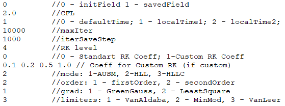

Первый параметр отвечает за инициализацию поля: при значении данного параметра 0 - поле будет инициализироваться значениями из файла разрешение \*.par; при значении 1 - будет подгружено последнее сохраненное поле из файла разрешения \*.sav. За инициализацию/подгрузку поля отвечает приватный метод *private_initialize_field()*, вызываемым внутри метода *solver_parameters()* после получения параметра. Здесь также подгружается молярная масса газа и удельная теплоемкость при постоянном давлении из файла \*.prop. После этого вызывается приватный метод *private_load_boundary()*, отвечающий за инициализацию граничных условий.

Во второй строчке задачется число Куранта. Индекс, подаваемый в третьей строке отвечает за выбор расчета шага по времени: 0 - без локального шага по времени; 1 - локальный шаг по времени, определяемый выражением; 2 - локальный шаг по времени, определяемый выражением.

maxIter - число итераций, которое выполнит программа при расчете системы уравнений Эйлера явным методом. *IterSaveStep* - шаг промежуточного сохранения результатов.

RKlevel - выбор количества шагов метода Рунге-Кутта. Следующий за данным параметром ключ отвечает за то, какие коэффициенты многошагового метода будут использоваться: 0 - стандартные коэффициенты, заложенные в программе; 1 - определенные пользователем. Если ключ равен 1, то из следующей строки считываются значения коэффициентов, иначе последующая строка игнорируется.

Ключ mode отвечает за то, какая схема расчета конвективных потоков будет использоваться: 1 - AUSM, 2 - HLL, 3 - HLLC.

order - порядок схемы. При выборе второго порядка значения реконструируются по методу DM. grad отвечает за способ расчета градиентов: 1 - по методу Грина-Гаусса; 2 - по методу наименьших квадратов.

Ключ limiters отвечает за выбор квазиодномерного ограничителя: 1 - Van Albada, 2 - MinMod, 3 - Van Leer.

### Структура явного солвера

За решение задачи отвечает метод *explicit_solve()* класса *psstGridFV*. В первую очередь здесь происходит вычисление конвективных переменных и инициализация значения невязок в ячейках нулевыми значениями.

Затем идет цикл по итерациям. Внутри цикла вычисляются сначала невязки методом *calculate()* класса *psstInterfaceGradCalc*, вызываемым при помощи указателя *std::shared_ptr\<psstInterfaceGridCalc\> grad_calculator_*

Далее происходит реализация k-шагового метода Рунге-Кутты: цикл по числу шагов. Внутри данного цикла происходит вычисление невязок методом класса *psstInterfaceConvectiveFlow calculate()*, вызываемым при помощи интеллектуального указателя *convective_flow_*, объявление которого внутри класса *psstGridFV* имеет вид *std::shared_ptr\<psstInterfaceConvectiveFlow\>*

После вычисления невязок идет цикл по всем объемам активной зоны (родительские зоны игнорируются). Для каждого объема последовательно вычисляются локальный шаг по времени, вектор консервативных переменных, вектор примитивных переменных. Если шаг Рунге-Кутты первый, то записываются значения на предыдущем временном слое. По завершению прохода объемов идет учет граничных условий.

По завершению процесса или по прохождению шага промежуточно сохранения происходит вывод данных при помощи класса *psstInterfaceOutputManager*.

## Учет граничных условий

Класс *psstInterfaceBoundaryCondition* отвечает за обработку граничных условий. Информация о граничных условиях поступает из файлов \*.bvp (динамические условия) и \*.btq (тепловые условия), структура которых следующая: указывается имя зоны, к которой необъодимо привязать граничное условие, идентификатор(ID) граничного условия и значения переменных на границе (если граничное условие подразумевает их наличие).

В зависимости от индекса создается соответствующий наследник класса *psstInterfaceBoundaryCondition*, который непосредственно реализует условие в программе.

Класс *psstInterfaceBoundaryCondition*, как и все его наследники, содержит методы *initialize()* и *calculate_at(size_t i)*. Внутри каждого из наследников имеется указатель *storage_* на структуру *psstVolumeStorage*, за учет граничных условий которой объект данного класса отвечает. Метод *initialize()* нужен для учета значений, падаваемых из файлов \*.bvp и \*.btq при их наличии. *calculate_at(size_t i)* отвечает за учет граничного условия в i-ом объеме зоны, на которую указывает *storage_*. Сам указатель инициализирует посредством вызова метода *get_data(psstVolumeStorage \* data)*. Метод *initialize()* используется лишь единожды в методе *private_load_boundary()* для инициализации граничного условия.

Для учета граничного условия в методе *explicit_solve* класса *psstGridFV* после вычисления невязок, консервативных и примитивных переменных идет цикл по граничным зонам, внутри которого в цикле по граничным объемам данной зоны последовательно учитывается динамическое граничное условие, затем - тепловое. После этого вычисляется значение плотности.

**Таблица 1. Динамические граничные условия.

| Граничное условие | ID условия | Класс | Параметры |
|:----------------:|:----------------:|:----------------:|:----------------:|
| Сверхзвуковой вход | 23 | psstSupersonicInlet | компоненты скорости, давление|
| Сверхзвуковой выход | 26 | psstSupersonicOutlet | |
| Стенка с проскальзыванием| 15 | psstWallInviscid | |
| Дозвуковой вход | 27 | psstInlet | компоненты скорости |
| Дозвуковой выход | 25 | psstOutlet | давление |

**Сверхзвуковой вход:** при использовании метода *initialize()* присваивает объемам граничной зоны значения компонент скорости и давления, полученных из файла \*.bvp. Метод *calculate_at(size_t i)* ничего не делает и оставлен для совместимости с интерфейсом.

**Сверхзвуковой выход:** при использовании метода *initialize()* для каждого из объемов граничной зоны вызывает метод *calculate_at(size_t i)*. Метод *calculate_at(size_t i)* для каждого i-го объема граничной зоны присваивает значения компонент скорости и давления соседнего неграничного объема (т.е. происходит экстраполяция всех переменных).

**Стенка с проскальзыванием:** при использовании метода *initialize()* для каждого из объема граничной зоны вызывает метод *calculate_at(size_t i)*. Метод *calculate_at(size_t i)* для каждого i-го объема граничной зоны присваивает значение давления соседнего объема и тангециальной компоненты скорости соседнего объема. Таким образом, нормальная компонента скорости приравнивается нулю, давление и плотность экстраполируются.

**Дозвуковой вход:** при использовании метода *initialize()* присваивает объемам граничной зоны значения компонент скорости, полученных из файла \*.bvp и вызывает для каждого из объемов граничной зоны метод *calculate_at(size_t i)*. Метод *calculate_at(size_t i)* для каждого i-го объема граничной зоны присваивает значение давления соседнего неграничного объема.

**Дозвуковой выход:** при использовании метода *initialize()* присваивает объемам граничной зоны значчение давления, полученное из файла \*.bvp и вызывает для каждого из объемов граничной зоны метода *calculate_at(size_t i)*. Метод *calculate_at(size_t i)* для каждого i-го объема граничной зоны присваивает значения компонент скорости соседнего неграничного объема. Таким образом, задаются значение статического давления, компоненты скорости экстраполируются.

**Таблица 1. Тепловые граничные условия.

| Граничное условие | ID условия | Класс | Параметры |
|:----------------:|:----------------:|:----------------:|:----------------:|
| Условие входа | 27 | psstThermalInlet | температура |
| Условие выхода | 25 | psstThermalOutlet | |
| Адиабатическая стенка | 18 | psstThermalWall_Q | |

**Условие входа:** при использовании метода *initialize()* присваивает объемам граничной зоны значение температуры, полученное из файла \*.btq. Метод *calculate_at(size_t i)* ничего не делает и оставлен для совместимости с интерфейсом.

**Условие выхода и адиабатическая стенка:** при использовании метода *initialize()* для каждого из объемов граничной зоны вызывает метод *calculate_at(size_t i)*. Метод *calculate_at(size_t i)* для каждого i-го объема граничной зоны присваивает значение температуры неграничного соседнего объема.

## Расчет градиентов

За расчет градиентов переменных внутренних объемов сетки отвечает класс *psstInterfaceGradientCalc*. В зависимости от значения ключа, полученного в методе *solver_parameters()*, создается соответствующий наследник класса *psstInterfaceGradientCalc* (*psstGreenGauss* или *psstLeastSquare*), отвечающий за расчет градиентов.

Класс *psstInterfaceGradientCalc*, как и его наследники, имеет методы *initialize()* и *calculate()*. Метод *initialize()* вызывается единожды в методе *solver_parameters()*. Он необходим для расчета вспомогательных параметров, которые не изменяются в процессе вычислений, но активно используются при вычислении градиентов (к примеру, матрица коэффициентов в методе наименьших квадратов). За расчет градиентов отвечает метод *calculate()*. При этом градиенты в граничных ячейках принимаеются равными нулю.

## Реконструктор и ограничители

Реконструкцию переменных на грани реализуют наследники класса *psstInterfaceValueReconstructor*. Здесь имеется метод *reconstruct_vals*, принимающий в качестве параметров интеллектуальный указатель на грань(*std::shared_ptr\<const psstInterfaceFace\>*) и вектор указателей (*std::vector\<std::shared_ptr\<psstInterfaceVariable & rvars\>\>*). Ориентируясь на соседние объемы принятой в качестве параметра грани, записивает реконструированные значения переменных в *rvars*.

В случае вычислений с первым порядком точности используется класс *psstFirstOrderReconstructor*, который в качестве реконструированных значений возвращает значения переменных в центрах соседних объемов. Для второго порядка точности используется реконструкция DM, реализованная в классе *psstReconstructorDM*. Для его работы необходимо предварительно подгрузить методом *attach_limiter(std::shared_ptr\<const psstInterfaceScalarLimiter\>)* соответсвующий ограничитель. Подгрузка ограничителя осуществляется в методе *solver_parameters()* после инициализации соответствующего ключу ограничителя.

Каждый из наследников класса *psstInterfaceScalarLimiter*, как и он сам, имеет метод *get_value(double numerator, double denumerator)*, который по значениям numerator и denumerator возвращает вещественное значение. В программе имеются реализации ограничителей Van Albada(*psstLimiterVanAlbada*), MinMod(*psstLimiterMinMod*), Van Leer (*psstLimiterVanLeer*). 

## Вычисление шага по псевдовремени

Вычисление шага по псевдовремени реализуют наследники чисто виртуального класса *psstInterfaceLocalTime*. В зависимости от подаваемого файлом \*.inp ключа создается соответствующий наследник: *psstUniformTime* при отсутствии вычисления локального шага по псевдовремени(шаг по псевдовремени един для всех ячеек), *psstLocalAcc1* или *psstLocalAcc2* при его использовании. Вычисление шага по псевдовремени осуществляется при помощи метода *calculate_at(std::shared_ptr\<psstInterfaceVolume\> vol)*. В случае единого шага по всем ячейками, данная величина рассчитывается единожды методом *initialize()*. 

## Вычисление конвективных потоков

Вычисление конвективных потоков в программе *PSST* осуществляется классами *psstConvectiveAUSM*, *psstConvectiveHLL*, *psstConvectiveHLLC*, отражающие схемы AUSM, HLL, HLLC соответственно. Данные классы являются наследниками чисто виртуального класса *psstInterfaceConvectiveFlow*. Для вычисления конвективных потоков и невязок используются метод *calculate()* в ходе которого происходит цикл по граням (за исключением родительских), где вычисляет прибавка к невязкам соседних к грани объемов. Стоит отметить, что в случае граничной грани, конвективные потоки и значения невязок вычисляются по значению в граничном объеме. В остальных случаях потоки и прибавка к невязкам вычисляется при помощи реконструированных значений на грани по соответствующей схеме.

## Запуск расчета в пакете PSST

Запуск расчета в пакете PSST будем производить на примере задачи сжатия сверхзвукового течения в канале с центральным клином. Рассмотрим невязкое сверхзвуковое течение в канале с центральным клином, тангенс угла которого равен 1/3. На вход подается сверхзвуковой поток с числом Маха равным 3.0, на выходе поток является сверхзвуковым.

### Пример двумерного расчета

Для решения двумерной задачи будем использовать сетку wedge40_120.cas размером 40x120, приведенную на рисунке ниже.

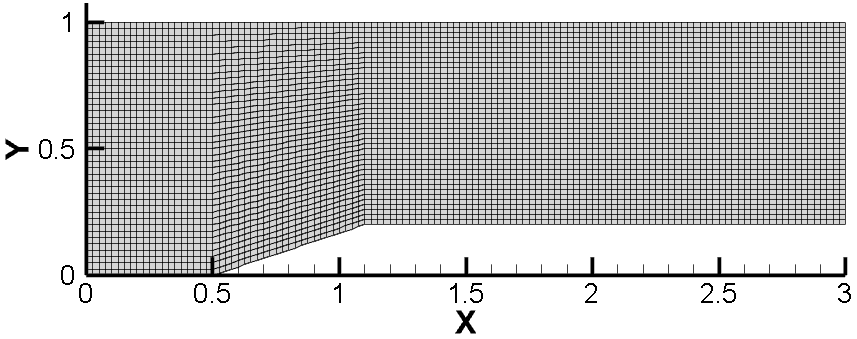

Перед запуском программы первым делом необходимо настроить файл "problem_manager". Для редактирования данного файла достаточно наличия любого текстового редактора. Здесь в первой строке указывается имя расчетной сетки, используемой для расчетов, а во второй - имя файлов \*.inp, \*.bvp, \*.btq, \*.par, \*.sav. Также создается файл с сеткой с именем \*.msh (необходим для проверки того, что программа корректно считала сетку).

Далее зададим постоянные свойства среды: молярную массу и удельную теплоемкость при постоянном давлении. Для этого необходимо отредактировать файл "wedge.prop" в любом текстовом редакторе. В первой строке вводим значение молярной массы в кг/Моль, а во второй - удельную теплоемкость при постоянном давлении в Дж/(кг \* К). Будем использовать в качестве среды воздух, таким образом M = 0.029 кг/Моль, cp = 1005 Дж/(кг \* К).

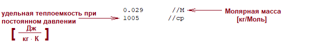

Настроим граничные условия. Для этого в любом текстовом редакторе отредактируем файлы "wedge.bvp" и "wedge.btg". В сетке wedge40_120.cas созданы следующие граничные зоны: in, out, wall, wedge, symm, up.

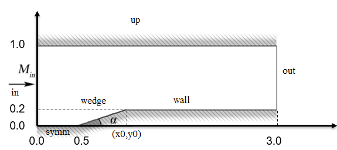

in - сверхзвуковой вход. Для постановки условия сверхзвукового входа необходимо поставить индекс граничного условия 23 и задать две компоненты скорости (значение скорость 1040 м/c примерно соответствует значению числа Маха 3), а также давление (100000 Па, что примерно равно атмосферному). На границе out ставим условие сверхзвукового выхода, индекс которого 26. Другие зоны wall, symm, wedge, up - это стенки. Индекс граничного условия стенки с проскальзыванием 15. Таким образом, мы задали динамические граничные условия, за которые отвечает файл "wedge.bvp"

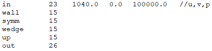

Настройка тепловых граничных условий происходит в файле "wedge.btq". Здесь на входе in ставим условие теплового входа с индексом 27. На стенках wall, symm, wedge, up ставим условия адиабатической стенки. На выходе out ставим условие теплового выхода. 

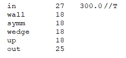

Теперь зададим параметры солвера. Будем решать задачу с первым порядком точности без использования вычисления локального шага по времени. Значение шага по времени определяется значением числа Куранта, которое мы зададим равным 0.5. Используем один шаг по схеме Рунге-Кутты(таким образом, многошаговая схема Рунге-Кутты в данном случае не используется). Поставленной задаче соответствует файл "wedge.inp", содержимое которого приведено на рисунке ниже:

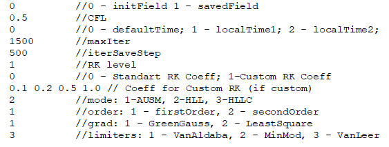

Как видно по первой строке из данного рисунка, мы начинаем новое решение, а не стартуем с предыдущего, а значит для расчетов обязательно необходимо наличие файла "wedge.par" (в противном случае, от предыдущего решения должен быть доступен файл "wedge.sav"). В файле "wedge.par" необходимо проинициализировать начальные значения компонент скорости, давления, температуры. Пример содержимого файла "wedge.par" приведен на рисунке ниже:

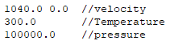

Настроив указанные выше файлы и предварительно скомпилировав программу, можно запускать расчет. В случае успеха на экране выведется краткая информация о считанной сетке, настройках солвера. Затем последует вывод итерационного процесса, где первый столбик - текущая итерация, второй столбик - затраченное на текущий момент время на решение задачи, а остальные - невязки.

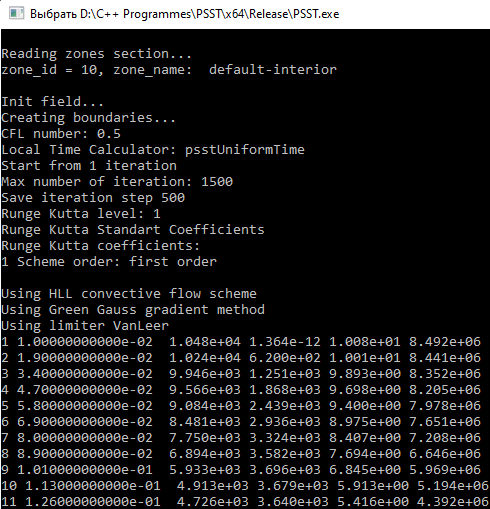

В процессе работы программы будут созданы файлы "wedge.sav", "wedge.dat" и "wedge_residual.dat". В файл "wedge.dat" выгружается решение в формате, используемом ANSYS Fluent. Таким образом, решение можно визуализировать при помощи файлов "wedge40_120.cas" и "wedge.dat", к примеру, в программе Tecplot. В файл "wedge.sav" также выгружается решение, но в формате более удобным для считывания программой. В файл "wedge_residual.dat" выгружаются невязки. В исходной папке имеются tecplot файлы ResidualIteration.lay, ResidualTime.lay, которые по информации из файла "wedge_residual.dat" строят зависимость невязок от итерации и от времени решения соответсвенно.

Ниже приведено полученное в результате расчета задачи поле давления
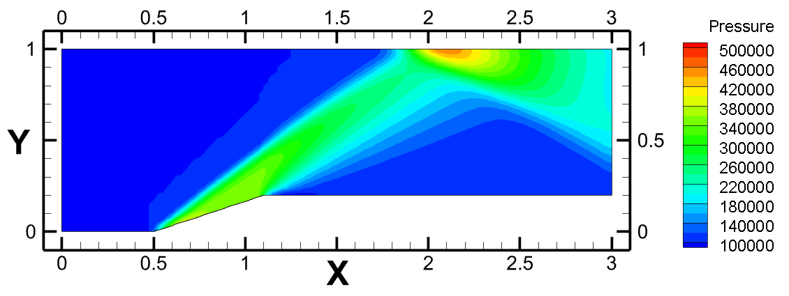

### Пример трехмерного расчета

## Список литературы

[1] Смирнов Е.М., Зайцев Д.К. "Метод конечных объемов в приложении к зада-
чам гидрогазодинамики и теплообмена в областях сложной геометрии Научно-
технические ведомости. СПбГПУ, 2004. №2. С. 70-81.

[2] J.Blazek "Computational Fluid Dynamics: Principles and Applications First edition
2001, pp. 29-324.

[3] Liou M.S., Steffen C.J., "A new flux splitting scheme Journal of Computational
Physics. 107 (1) (1993) 23–39.

[4] Harten A., Lax P.D., van Leer B., "On upstream differencing and Godunov-type
schemes for hyperbolic conservation laws SIAM Review. 25 (1) (1983) 35–61.

[5] Toro E.F., "Riemann solvers and numerical methods for fluid dynamics Springer-
Verlag, Berlin, Heidelberg (2009).

[6] Mavriplis D. J.”Revisiting the Least-squares Procedure for Gradient Reconstruction
on Unstructured Meshes”, NASA/CR-2003-212683 NIA Report No. 2003-06, pp. 2-
20.

[7] Alpesh Patel, “Development of an adaptive RANS solver for unstructured
hexahedral meshes”, PhD thesis, Universit´e Libre de Bruxelles, 2003, pp. 90-101.

[8] Batrh T. J. , Jespersen D. “The Design and Application of Upwind Schemes on
Unstructured Meshes”, AIAA Paper 89-0366, Jan.1989.

[9] Darwish M., Moukalled F. "TVD schemes for unstructured grids Int. J. Heat Mass
Transfer – 2003. – Vol.46. – P. 599–611

[10] Harten A. "High resolution schemes for hyperbolic conservation laws J. Comput.
Phys. – 1983. – Vol.49, No. 3. – P. 357-393.

[11] Jameson, A.; Schmidt, W.; Turkel, E.: "Numerical Solutions of the Euler Equations
by Finite Volume Methods Using Runge-Kutte Time-Stepping Schemes". AIAA
Paper 81-1259, 1981.

[12] E. V. Kolesnik, E. M. Smirnov "Some aspects of numerical modeling of inviscid
supersonic flow in a duct with a central wedge Journal of Physics: Conf. Series 1038.
– 2018

[13] Jinlan Gou, Xin Yuan and Xinrong Su "Adaptive mesh refinement method based
investigation of the interaction between shock wave, boundary layer, and tip vortex
in a transonic compressor"Proc IMechE Part G: J Aerospace Engineering 0(0) 1–22
IMechE 2017 pp. 3-8

[14] "ANSYS Fluent Guide. Appendix B Mesh Format"ANSYS, Inc. April 15, 2008

[15] A.A.Смирновский, Е.М.Смирнов "Высокопроизводительные вычисления с ис-
пользованием пакета OpenFOAM Санкт-Петербург 2018

[16] HUAZHONG TANG AND TAO TANG "ADAPTIVE MESH METHODS FOR
ONE- AND TWO-DIMENSIONAL HYPERBOLIC CONSERVATION LAWS"//
SIAM J. NUMER. ANAL. 2003 Society for Industrial and Applied Mathematics

[17] Jinlan Gou, Xin Yuan and Xinrong Su "Adaptive mesh refinement method based
investigation of the interaction between shock wave, boundary layer, and tip vortex
in a transonic compressor"// Proc IMechE Part G: J Aerospace Engineering 0(0)
1–22 2017

[18] А. Швец "Погружение в паттерны проектирования"//v2018-1.5, стр 100-118

[19] "ANSYS Fluent Theory Guide. Chapter 21: Adapting the Mesh"ANSYS Inc 2013,
pp. 687-712.

[20] J. F. Daunenhofer and J. R. Baron. "Grid Adaption for the 2D Euler
Equations". Technical Report

